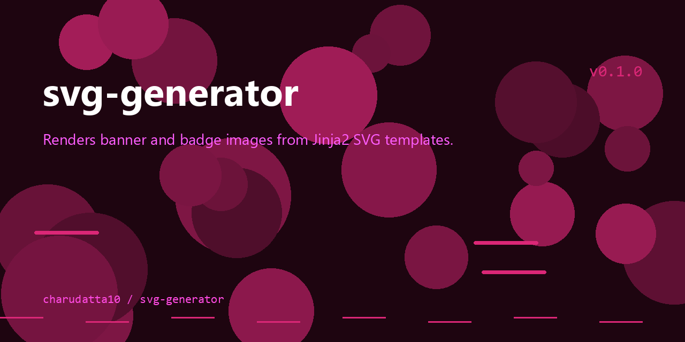

 
# SVG Generator

<p align="center">
  
</p>


<!-- Badges: Project Status GitHub -->


[](https://github.com/sponsors/charudatta10)
[](https://charudatta10.github.io/LinkNet/)
[](https://charudatta10.github.io/Portfolio/)


<!-- Badges: Tools used -->
`python` `just` `gig` `jinja2` `flask` `Waitress` 

## What is this? 🗎

SVG Generator renders banner and badge images from Jinja2 SVG templates. It ships as a Flask web service and a small CLI, with ready-made templates for banners, badges, and social-style SVGs. Text, size, and style placeholders are filled in dynamically on each request.

## Features 🌟

- Create banners. 
- Create badges. 
 

## Getting Started 🌱

Clone and install dependencies:

```bash
git clone https://github.com/charudatta10/svg-generator.git
cd svg-generator
pip install -r requirements.txt
```

Run the API server:

```bash
invoke run_api
```

Or run the CLI:

```bash
invoke run_cli
```

## Usage examples

Start the API server and render a banner:

```bash
python src/app.py
curl "http://localhost:8080/banner?type=origin&text1=Hello&text2=World&width=500&height=200"
```

Render a badge from JSON via the `/badges` endpoint, or run the CLI to render `tests/test1.svg` from `tests/test.json`.

## License

Distributed under the GNU General Public License v3.0 (GPL-3.0).

✨[Report a 🐛 or Request a ⭐](https://github.com/charudatta10/legendary-dollop/issues)✨

© 2025 Charudatta Korde. Some Rights Reserved. Attribution Required. Non-Commercial Use & Share-Alike.  

<!-- Acknowledgment, References, Misc -->